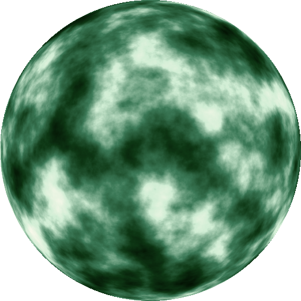

## Agate, a simple and embeddable programming language

Agate is a scripting language with a simple yet powerful object-oriented syntax written in C99. It can easily be embedded in any application (e.g. games) with only three files to copy in your source tree. It has decent performance thanks to a bytecode virtual machine and a single pass compiler.

### Hello World!

```
IO.println("Hello World!") #> Hello World!

# a comment

def fib(n) {
  if (n < 2) {
    return n
  }
  return fib(n - 1) + fib(n - 2)
}

IO.println("fib(28) = %(fib(28))") #> fib(28) = 317811

class Vec2 {
  construct new(x, y) {
    @x = x
    @y = y
  }
  x { @x }
  y { @y }
  +(other) { Vec2.new(@x + other.x, @y + other.y) }
  to_s { "(%(@x),%(@y))" }
}

def vec(x, y) { Vec2.new(x, y) }

def a = vec(1, 2)
def b = vec(3, 4)
IO.println("%(a + b)") #> (4,6)
```

### Acknowledgements

Agate is largely inspired by the great work of [Bob Nystrom](http://journal.stuffwithstuff.com/), especially his awesome book [Crafting Interpreters](http://craftinginterpreters.com/) and his classy little scripting language [Wren](https://wren.io/).
