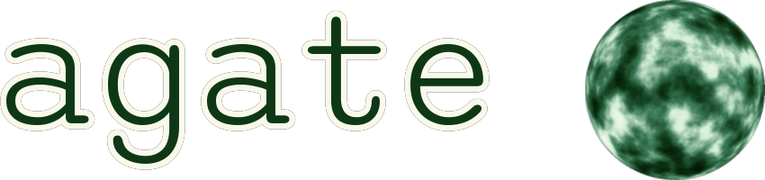

# Agate, a simple and embeddable programming language



Agate is a simple object-oriented language with a familiar syntax. It is largely inspired by [Wren](https://wren.io/) with some different choices.

It can be embedded in any application (e.g. games). Only three files are necessary: `agate.h`, `agate.c`, `core.inc`, and that's all. You can copy them in your source tree, and add `agate.c` in your compilation list.

```
IO.println("Hello World!") #> Hello World!

# a comment

def fib(n) {
  if (n < 2) {
    return n
  }
  return fib(n - 1) + fib(n - 2)
}

IO.println("fib(28) = %(fib(28))") #> fib(28) = 317811

class Vec2 {
  construct new(x, y) {
    @x = x
    @y = y
  }
  x { @x }
  y { @y }
  +(other) { Vec2.new(@x + other.x, @y + other.y) }
  to_s { "(%(@x),%(@y))" }
}

def vec(x, y) { Vec2.new(x, y) }

def a = vec(1, 2)
def b = vec(3, 4)
IO.println("%(a + b)") #> (4,6)
```
